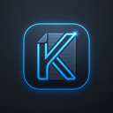
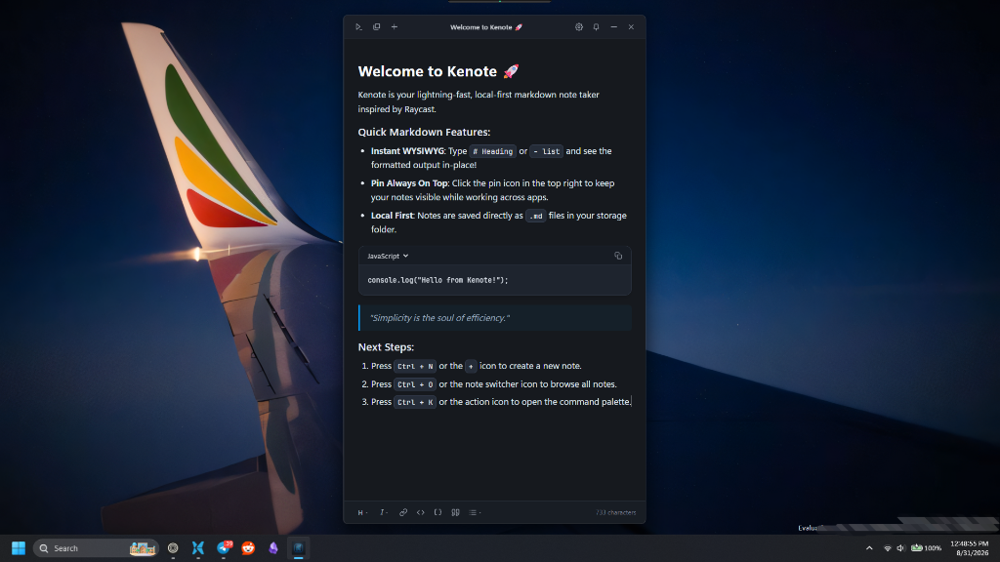
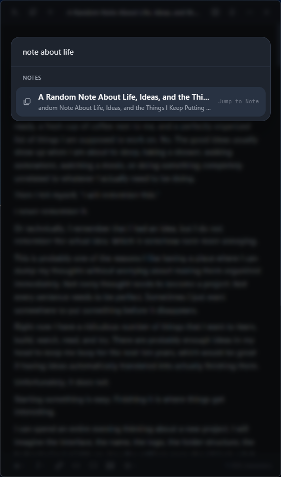
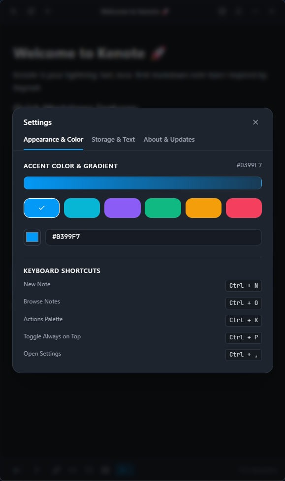

# Kenote 🚀

> A minimal, lightning-fast, local-first Raycast-inspired markdown note-taking app for Windows, macOS, and Linux built with **Tauri v2**, **React**, **TypeScript**, and **Tailwind CSS**.

<p align="center">
  
</p>

<p align="center">
  
</p>

---

## 📸 Screenshots

<p align="center">
  
  
</p>

---

## ✨ Features

- 📝 **Live WYSIWYG Markdown Formatting**: Headings (`#`), bold (`**`), italics (`*`), strikethrough (`~~`), underline, blockquotes (`>`), task lists (`[ ]`), and tables render seamlessly live as you type.
- ⚡ **Global Launch Shortcut**: Summon or hide Kenote from anywhere across your OS with customizable global hotkeys (`Alt + Shift + K` by default, with tactile keycap configuration).
- 🗂️ **Note Switcher & Fast Search**: Browse, filter, pin, and manage all your notes instantly with `Ctrl + O`.
- 🔁 **Quick Switcher HUD (MRU)**: Cycle through recently visited notes with a Raycast-style floating HUD overlay using `Ctrl + Tab` or `Alt + Tab`.
- 📌 **Always-On-Top Pinning**: Keep your notes floating over all active apps with a single click or `Ctrl + P`.
- 💾 **Local-First .md Storage**: Your notes belong to you — stored directly as standard `.md` markdown files on your local drive with automatic debounce saving, custom folder selection, and live disk sync.
- ⚡ **Command Actions Palette**: Quick-access all commands, actions, and settings with `Ctrl + K`.
- 🗑️ **Trash & Instant Undo**: Safely delete notes to trash with toast-based undo and recovery options.
- 🔍 **Global & Editor Zoom**: Scale UI elements and text independently (`Ctrl + +`, `Ctrl + -`, `Ctrl + 0`).
- 🎨 **Custom Accent Themes & Typography**: Dynamic accent colors, gradient presets, customizable editor fonts, line heights, and sizes.
- 💻 **Syntax Highlighting & Copy Code**: Code blocks with automatic language detection, syntax highlighting, and 1-click clipboard copying.
- 🔄 **Built-in Auto-Updater**: Seamless background and on-demand update checks powered by Tauri's native updater.

---

## ⌨️ Keyboard Shortcuts

| Shortcut | Action |
| --- | --- |
| `Alt + Shift + K` | Global Summon / Hide Kenote (Customizable) |
| `Ctrl + N` | Create New Note |
| `Ctrl + O` | Browse Notes Switcher |
| `Ctrl + K` | Open Actions / Command Palette |
| `Ctrl + Tab` / `Alt + Tab` | Quick Switcher HUD (Cycle Recent Notes) |
| `Ctrl + P` | Toggle Pin Always On Top |
| `Ctrl + S` | Force Save Note to Disk |
| `Ctrl + ,` | Open Settings |
| `Ctrl + Shift + C` | Copy Note as Markdown |
| `Ctrl + +` / `Ctrl + =` | Zoom In UI |
| `Ctrl + -` | Zoom Out UI |
| `Ctrl + 0` | Reset UI Zoom |
| `Esc` | Close Modal / Cancel Quick Switcher |

---

## 🛠️ Tech Stack

- **Desktop Core**: [Tauri v2](https://tauri.app) (Rust)
- **Frontend**: [React 18](https://react.dev), [TypeScript](https://www.typescriptlang.org), [Vite](https://vitejs.dev)
- **Styling**: [Tailwind CSS](https://tailwindcss.com)
- **Rich Editor**: [Tiptap Editor](https://tiptap.dev) + [tiptap-markdown](https://github.com/hunghoang7300/tiptap-markdown)
- **Icons**: [Lucide Icons](https://lucide.dev)

---

## 🚀 Development & Build

### Prerequisites

- [Node.js](https://nodejs.org) (v18+) & [pnpm](https://pnpm.io)
- [Rust](https://rustup.rs)

### Install Dependencies

```bash
pnpm install
```

### Run in Development

```bash
pnpm tauri dev
```

### Run Tests

```bash
pnpm test
```

### Build Production Executable / Installer

```bash
pnpm tauri build
```

The output installers (`.msi`, `.exe`, `.dmg`, `.deb`, `.AppImage`) will be generated in `src-tauri/target/release/bundle/`.

---

## 📄 License

MIT License (c) 2026 [yetemgetaB](https://github.com/yetemgetaB)
